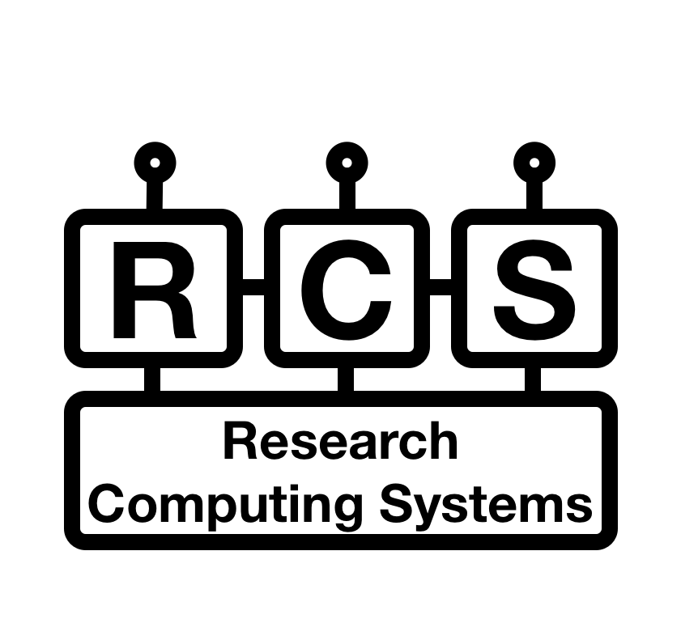
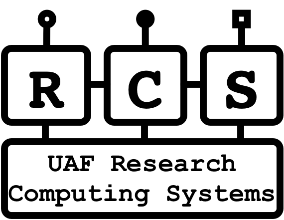
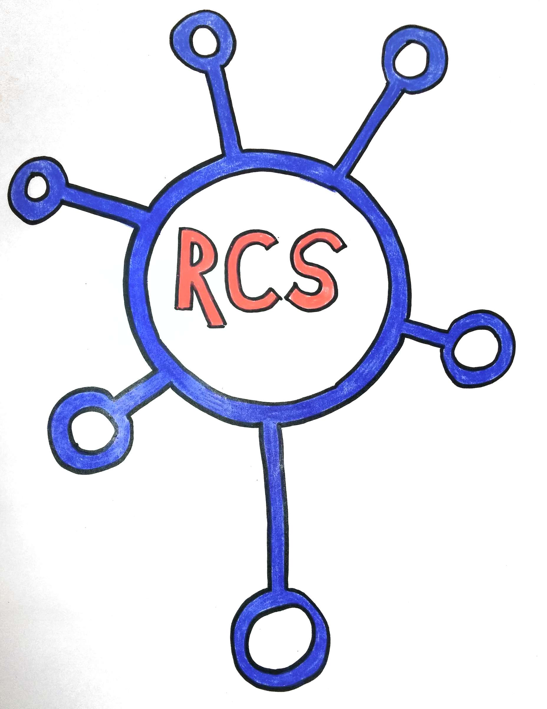
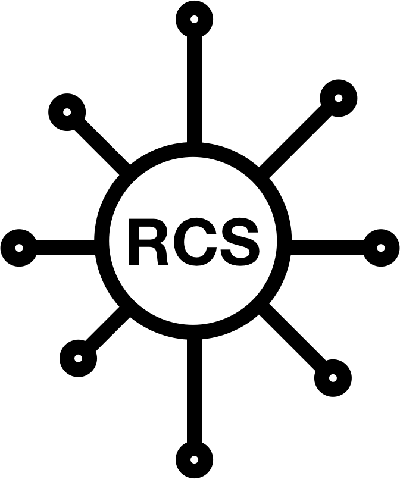

# RCS logo

Research Computing Systems Logo development repo.

Development spot for the RCS logo.

## draft option 1

Omnigraffle diagram with a systems and endpoints as a basis for the logo by @dayne

Another version by @loforbes with the classic computer font (console) and the internal, [external service end points and management end point](rcs-endpoints/rcs_endpoints.jpg) used.

## draft option 2

Who says the draft logo options have to be done in Omnigraffle.  Crayons are valid logo drafting tools (or in this case sharpy marker and colored pencil by @dayne)

And then later make them into fancy things:

